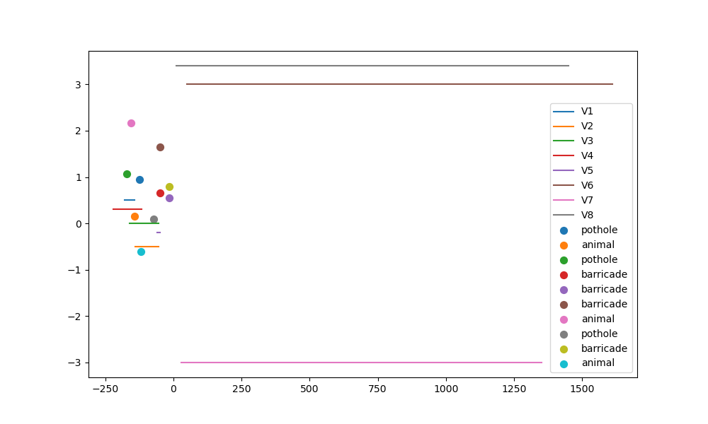

# Village to Highway Merge Demo

This project simulates a traffic scenario where vehicles approach a highway from a village road and interact with various assets (potholes, barricades, animals, unpaved patches). The simulation generates vehicle trajectories and provides visualizations and data exports.

## Files

- `main.py`: Entry point for running the simulation and saving outputs.
- `config.py`: Scenario configuration parameters and initial vehicle definitions.
- `assets.py`: Asset generation logic.
- `vehicles.py`: Vehicle initialization.
- `behaviors.py`: Vehicle behavior updates based on assets and scenario.
- `simulator.py`: Simulation loop and trajectory recording.
- `exporters.py`: Functions for saving scenario data and plotting trajectories.
- `scenario.json`: Example generated scenario data (vehicles and assets).
- `trajectories.csv`: Example output of vehicle trajectories over time.

## Running the Simulation

1. Install dependencies:
   ```bash
   pip install matplotlib pandas
   ```

2. Run the simulation:
   ```bash
   python main.py
   ```

3. Outputs:
   - `scenario.json`: Scenario configuration and initial state.
   - `trajectories.csv`: Vehicle positions and states over time.
   - `trajectories.png`: Visualization of the scenario (see sample below).

## Visualization



The plot shows vehicle trajectories and asset locations along the merge scenario.

## Customization

- Edit `config.py` to change scenario parameters and initial vehicle layouts.
- Modify `assets.py` to adjust asset types and placement logic.
- Extend `behaviors.py` to add more complex vehicle interaction rules.

## License

MIT License
